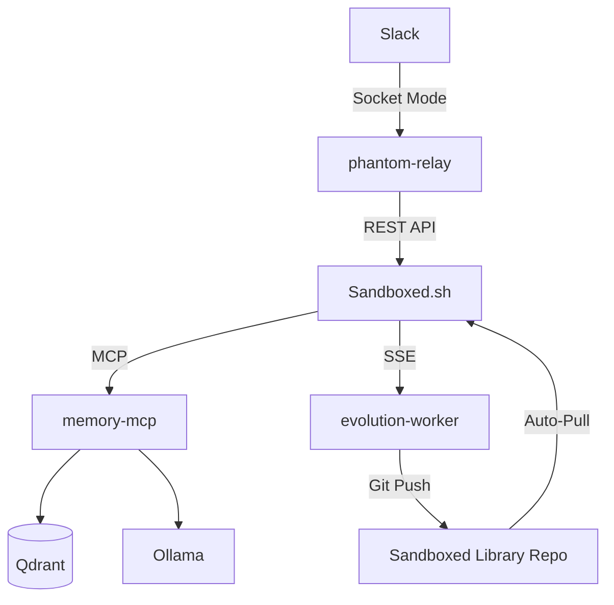

# Phantom Sidecar Stack

A unified set of autonomous agent extensions for **Sandboxed.sh**.

This stack extracts the advanced "agentic" capabilities originally built in the monolithic Phantom repo and ports them into modular sidecars that attach to the Rust orchestrator via its standard APIs.

Prerequisite: `sandboxed.sh` must already be running with a working `opencode` backend. These sidecars extend the orchestrator; they do not replace it.

## Components

### 1. [memory-mcp](./memory-mcp)
A Model Context Protocol (MCP) server that wraps Qdrant and Ollama.
- **Tools**: `store_memory`, `search_memory`.
- **Transport**: Streamable HTTP at `http://memory-mcp:3333/mcp` (compose default).
- **Use Case**: Injected into any Sandboxed workspace to provide long-term episodic and semantic memory.

### 2. [phantom-relay](./phantom-relay)
A bridge between messaging channels (Slack) and Sandboxed missions.
- **Realtime**: Translates Slack messages into Sandboxed mission inputs and streams NDJSON outputs back to Slack threads.
- **Persistence**: Maps Slack `thread_ts` to Sandboxed `mission_id` using a local SQLite thread map.

### 3. [evolution-worker](./evolution-worker)
An asynchronous worker that watches for mission completions and triggers self-evolution.
- **Pipeline**: Runs the 6-gate Phantom evolution engine on mission transcripts.
- **Git Loop**: Generates persona/rule improvements and commits them directly to the Sandboxed Git Library.
- **Judges**: Defaults to heuristic judges (no Claude). Set `EVOLUTION_USE_LLM_JUDGES=1` and `ANTHROPIC_API_KEY` to enable Claude judges.

## Getting Started

1. **Setup Environment**:
   ```bash
   cp .env.template .env
   # Fill in the Slack tokens and LIBRARY_REPO_URL
   ```

2. **Deploy**:
   The stack is managed via Docker Compose.
   ```bash
   docker compose up -d
   ```

## Architecture


