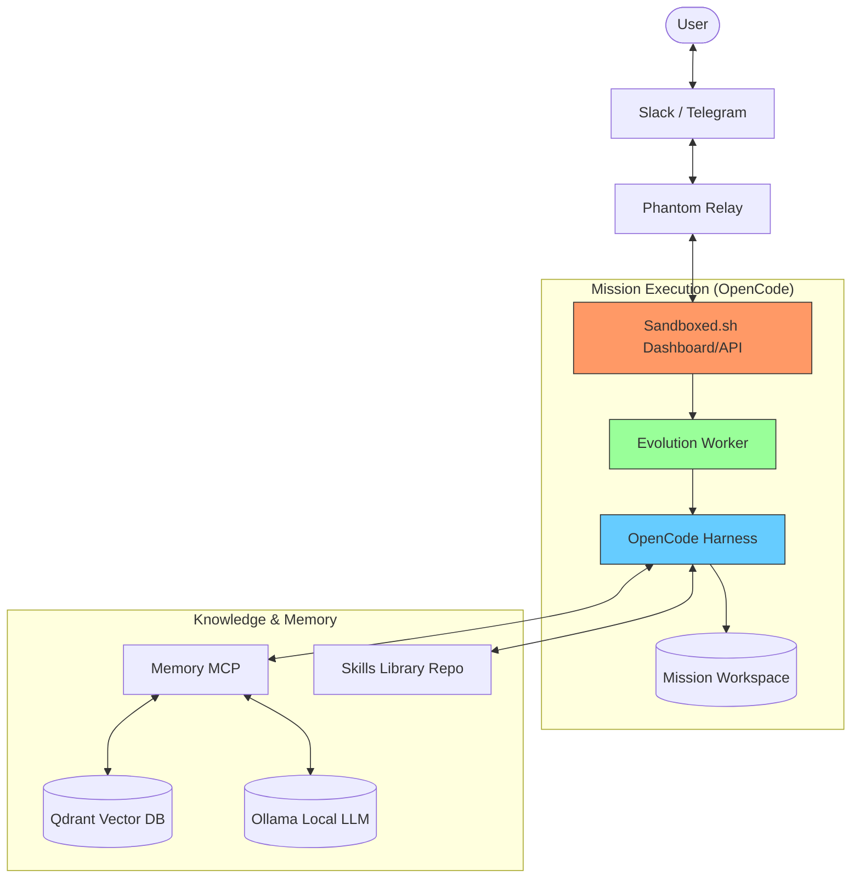

# Phantom Stack: Post-Deployment Configuration Guide

This guide explains how to configure and verify your Phantom Stack components once the containers are running.

## 🏗️ Architecture Overview (OpenCode Powered)

The Phantom Stack integrates **Sandboxed.sh** (the orchestrator) with the **Phantom Agent** ecosystem, now utilizing the **OpenCode** runtime for mission execution.

> [!NOTE]
> **Which Docs Should I Follow?**
> *   **Primary**: Follow **this guide (`CONFIG_GUIDE.md`)** for the initial stack configuration and wiring.
> *   **Infrastructure Deep Dive**: Use the [Sandboxed.sh Docs](https://sandboxed.sh/docs) for issues with the dashboard, missions, or container isolation.
> *   **Agent Brain Deep Dive**: Use the [Phantom Docs](https://github.com/ghostwright/phantom) for details on memory modeling, evolution engines, and custom role definitions.



---

## 🛠️ Service Configuration

### 1. Sandboxed.sh Dashboard
Access the dashboard to monitor agent activity and manage workspace lifecycles.

- **URL**: `http://localhost:3333` (as per default `docker-compose.yml`)
- **Login**: Use the `SANDBOXED_DASHBOARD_PASSWORD` defined in your `.env`.
- **JWT**: Ensure `SANDBOXED_JWT` is set in both `.env` and matching across Relay/Worker to allow authorized API calls.

### 2. OpenCode & Skills Library
The "brain" of your agent is defined in your Skills Library.

- **Repo Sync**: Configure `LIBRARY_REPO_URL` in `.env` to point to your Git repository (e.g., `phantom-library`).
- **Provisioning**: Sandboxed.sh automatically writes `opencode.json` and `.opencode/` configurations into every mission workspace based on the Library content.
- **Agent Definitions**: Ensure `oh-my-opencode.json` exists in your Library to define the available agent roles.

### 3. Phantom Relay (Slack / Telegram)
Connect your agent to communication channels.

- **Slack Tokens**:
    - `SLACK_BOT_TOKEN`: Starts with `xoxb-...`
    - `SLACK_APP_TOKEN`: Starts with `xapp-...` (Socket Mode enabled)
- **Telegram**: (If enabled) Set `TELEGRAM_BOT_TOKEN`.
- **Backend Setting**: Ensure `SANDBOXED_BACKEND=opencode` is set in the Relay environment to trigger the correct harness.

### 4. Memory Tier
The agent uses persistent memory to "evolve" and remember past interactions.

- **Qdrant**: Stores vector embeddings. Access the UI at `http://localhost:6333/dashboard`.
- **Ollama**: Provides local embeddings. 
    - **Crucial**: After deployment, you may need to pull the embedding model:
      ```bash
      docker exec -it sandboxed-ollama ollama pull llama3 # or your preferred model
      ```

---

## 📋 Environment Variable Reference

| Variable | Description | Default / Example |
| :--- | :--- | :--- |
| `SANDBOXED_DASHBOARD_PASSWORD` | Password for the web UI. | `change-me` |
| `SANDBOXED_JWT_SECRET` | Secret used to sign service tokens. | `random-string` |
| `SANDBOXED_JWT` | Long-lived token for internal service auth. | `[Generated JWT]` |
| `LIBRARY_REPO_URL` | URL to your agent skills/rules repository. | `https://github.com/.../phantom-library.git` |
| `ANTHROPIC_API_KEY` | Key for judicial LLM (Claude). | `sk-ant-...` |
| `SLACK_BOT_TOKEN` | Bot User OAuth Token. | `xoxb-...` |
| `SLACK_APP_TOKEN` | App-level Token (Socket Mode). | `xapp-...` |
| `MEMORY_MCP_HTTP_PORT` | Port for the memory service. | `3333` (Internal) / `3334` (Host) |

---

## ✅ Verification Checklist

1. [ ] **Dashboard Access**: Can you log in to `http://localhost:3333`?
2. [ ] **Library Sync**: Does the Sandboxed dashboard show your skills/tools?
3. [ ] **Slack Connectivity**: Is the Phantom Relay logging `[phantom-relay] Started` and responding to mentions?
4. [ ] **Memory Health**: Is the Evolution Worker able to connect to `http://memory-mcp:3333`?
5. [ ] **Model Pull**: Has Ollama successfully pulled the required models for embeddings?
